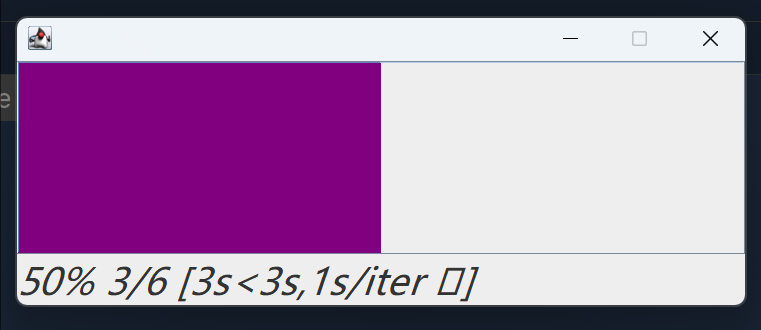

# Storch-Tqdm: Progress Bar for Storch Training

## Introduction
Storch-Tqdm is a feature-rich progress bar library designed specifically for Storch training. It provides an intuitive and visually appealing way to monitor training progress. One of its key advantages is the ability to customize the progress bar color, supporting both single-color and random-color modes.

## Features
- **Color Customization**: Choose from a variety of predefined colors for a single-color progress bar or enable random color changes for a dynamic visual experience.
- **GUI Support**: Optionally display a graphical progress bar for a more user-friendly interface.
- **Multi-Structure Compatibility**: Works seamlessly with common Scala data structures such as `List`, `Set`, and `Map`.

## Installation
This project uses SBT for dependency management. To compile the project, run the following command in the project root directory:
```bash
sbt compile

libraryDependencies += "io.github.mullerhai" % "storch-tqdm_3" % "0.0.2"
```

```scala 3
for (i <- tqdm(List(1, 2, 3, 4, 5, 6,7,8,9,10,11,12), "iterating",color =None,sleepSpeed = Some(50),colorRandom = false)) {
  try{
    Thread.sleep(1000)
    println(i)
  }
  catch {
    case e: InterruptedException =>
      println(e.printStackTrace())
  }
}
```

```scala 3
for (i <- tqdm(List(1, 2, 3, 4, 5, 6), true)) {
  try {
    Thread.sleep(1000)
    println(i)
  }
  catch {
    case e: InterruptedException =>
      e.printStackTrace()
  }
}
```

```scala 3
val x = Tqdm.tqdm(100, "iterating",color =None,sleepSpeed = Some(50),colorRandom = true)
for (i <- 0 until 100) {
  x.update(1)
  println(i)
  //      Thread.sleep(100)
}
```

```scala 3
val n = 100
val x = tqdm(n, "Storch_Training", true,color =None,sleepSpeed = Some(50),colorRandom = false)
for (i <- 0 until n) {
  try Thread.sleep(100)
  catch {
    case e: InterruptedException =>
      e.printStackTrace()
  }
  x.update(1)
}
```
## Screenshots
Here are three screenshots demonstrating the functionality of Storch-Tqdm:

 Single-Color Progress Bar
 

 Random-Color Progress Bar
 

 

 GUI Progress Bar
 
Please replace path/to/single_color_image.png, path/to/random_color_image.png, and path/to/gui_image.png with the actual file paths of your screenshots.

## Conclusion
Storch-Tqdm offers an exceptional experience for Storch training. Its color customization and GUI support make it a powerful tool for monitoring training progress effectively.